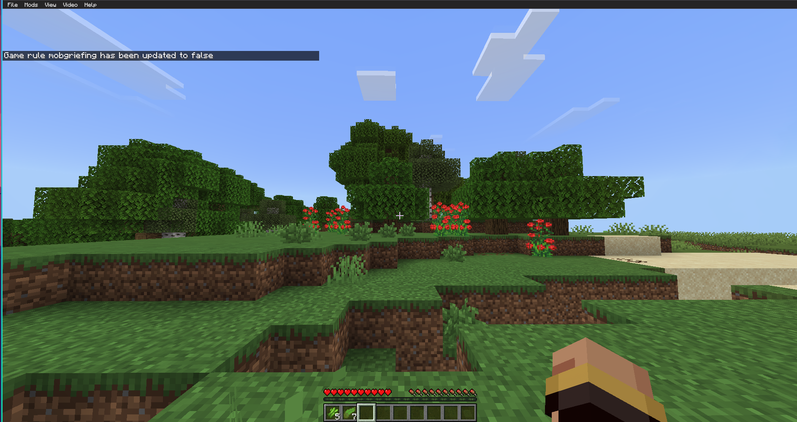
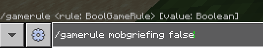
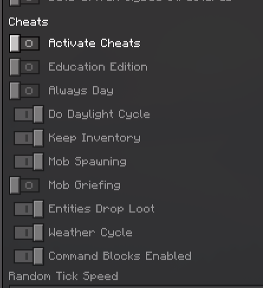

# mcpelauncher-cheatlesstweaks

A port of the **[CheatlessTweaks](https://github.com/Tallis-Larsen/CheatlessTweaks)** mod for **MCPELauncher**.

This mod allows changing selected gamerules **without enabling cheats** and **without disabling achievements**.

---
## Supported gamerules

- `mobGriefing`
- `keepInventory`

These rules can be changed using the normal `/gamerule` command.

**Achievements remain enabled**

---

## Usage

Download the built `.so` file from **Releases** and place it into the `mods` directory.

### Example





```mcfunction
/gamerule mobgriefing false
/gamerule keepinventory true
```

## Building

Prerequisites:

- Android NDK r27 or later. [Download](https://developer.android.com/ndk/downloads)
- CMake 3.15 or later

Replace `/path/to/ndk` with the path to the Android NDK:

```
cmake -DCMAKE_TOOLCHAIN_FILE=/path/to/ndk/build/cmake/android.toolchain.cmake -DANDROID_ABI=x86_64 -DCMAKE_BUILD_TYPE=Release -B build
cmake --build build
```

This will create a `build` directory containing the mod file. Install it as described in [Usage](#usage).


